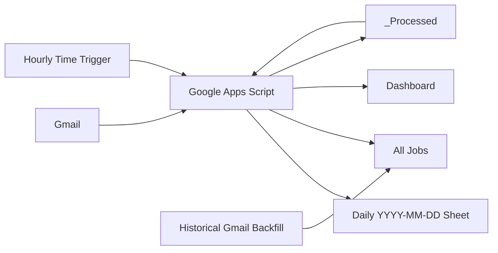

# Gmail Job Tracker - Automated Recruiter & Application Tracking

A Google Apps Script automation that turns Gmail job-search activity into a structured Google Sheets tracking system. It tracks recruiter/vendor outreach, direct job applications, recruiter stages, application statuses, historical activity, daily sheets, a permanent `All Jobs` view, and a dashboard.

> **The problem:** During an active job search, recruiter emails, application confirmations, RTRs, submissions, assessments, interviews, rejections, and offers are spread across Gmail and become difficult to track manually.
>
> **The fix:** This project scans Gmail on a schedule, classifies job-search messages, writes structured records into Google Sheets, updates statuses from later replies, prevents duplicate processing, and can reconstruct historical activity in batches.

---

## Demo

- **Video walkthrough:** Record using [`docs/DEMO_SCRIPT.md`](docs/DEMO_SCRIPT.md)
- **Audio breakdown:** Record using [`docs/AUDIO_SCRIPT.md`](docs/AUDIO_SCRIPT.md)
- **Setup guide:** [`docs/SETUP_GUIDE.md`](docs/SETUP_GUIDE.md)
- **Printable PDF guide:** [`docs/Gmail_Job_Tracker_Setup_Guide.pdf`](docs/Gmail_Job_Tracker_Setup_Guide.pdf)

> The repository contains no personal Gmail data, recruiter records, OAuth credentials, or private Google Sheet IDs.

---

## Architecture



### Live flow

1. A time-driven trigger runs `runJobTrackerAutomation()`.
2. Sent mail is checked for recruiter/vendor communication.
3. Incoming mail is checked for direct job applications and ATS confirmations.
4. Recruiter and portal status messages are detected.
5. Daily sheets are updated.
6. `All Jobs` is kept in sync for long-term history.
7. `_Processed` stores message-level processing state to prevent duplicate work.
8. The Dashboard is refreshed.

### Historical flow

Historical Gmail is processed in small batches so a large mailbox can be scanned without relying on one long Apps Script execution.

```text
Recruiter history
      ->
Portal application history
      ->
Portal status history
      ->
Recruiter status history
```

---

## Features

- Automatic daily sheet creation using `YYYY-MM-DD`
- Recruiter/vendor sent-email detection
- Recruiter name, company, email, phone, and job-title extraction
- Sent vs. follow-up detection
- Direct application and ATS confirmation detection
- Portal identification for common job boards and applicant tracking systems
- Company and position extraction from application emails
- Recruiter status tracking: Sent, Follow-up Sent, Replied, RTR, Submitted, Assessment, Interview, Rejected, Offer, Closed
- Portal status tracking: Applied, Assessment, Interview, Rejected, Offer, Withdrawn
- Thread-aware matching to reduce incorrect status updates
- Status-progression safeguards to avoid moving records backward incorrectly
- Message-ID duplicate prevention
- Permanent `All Jobs` master sheet
- Batched historical Gmail backfill
- Hidden `_Processed` state sheet
- Google Sheets Dashboard
- Gmail deep links back to the source thread
- Apps Script locking to reduce overlapping runs

---

## Google Sheets layout

```text
TEMPLATE
  |-- RECRUITER / VENDOR EMAILS SENT
  |-- 4 blank rows
  `-- PORTAL / DIRECT JOB APPLICATIONS

YYYY-MM-DD
YYYY-MM-DD
...

All Jobs
Dashboard
_Processed  (hidden)
```

### Recruiter / Vendor columns

| Date | Company | Recruiter Name | Phone Number | Email | Job Title | Status | Email Link |
|---|---|---|---|---|---|---|---|

### Portal / Direct Application columns

| Date | Portal | Company | Position | Application # | Status | Email Link |
|---|---|---|---|---|---|---|

---

## Status logic

### Recruiter / Vendor

```text
Sent -> Follow-up Sent -> Replied -> RTR -> Submitted -> Assessment -> Interview -> Offer
```

Possible terminal outcomes include `Rejected`, `Closed`, and `Offer`.

The automation uses progression rules so a later low-stage message does not normally overwrite a more advanced stage. For example, an Interview should not be replaced by Replied just because a generic reply arrives later.

### Portal / Direct Applications

```text
Applied -> Assessment -> Interview -> Offer
```

Possible terminal outcomes include `Rejected`, `Withdrawn`, and `Offer`.

See [`docs/STATUS_LOGIC.md`](docs/STATUS_LOGIC.md) for the matching and progression rules.

---

## Duplicate prevention

A hidden `_Processed` sheet records the Gmail message ID together with the workflow type. This makes repeated trigger executions idempotent for the same workflow.

Example workflow keys:

```text
RECRUITER
PORTAL
STATUS
RECRUITER_STATUS
ALL_RECRUITER
ALL_PORTAL
ALL_RECRUITER_STATUS
ALL_PORTAL_STATUS
```

---

## Historical backfill

Large mailboxes cannot safely be processed in one Apps Script run. The historical import therefore uses Script Properties to save a Gmail search position and temporary time-driven triggers to continue processing later.

Current batch-oriented workflows include:

- Historical recruiter/vendor backfill
- Historical portal/application backfill
- Historical portal status backfill
- Historical recruiter status backfill

See [`docs/HISTORICAL_BACKFILL.md`](docs/HISTORICAL_BACKFILL.md).

---

## Tech stack

| Layer | Technology |
|---|---|
| Language | JavaScript (Google Apps Script V8) |
| Automation | Google Apps Script |
| Email source | Gmail / `GmailApp` |
| Storage | Google Sheets |
| Scheduling | Apps Script time-driven triggers |
| State | Script Properties + `_Processed` sheet |
| Concurrency control | `LockService` |
| Dashboard | Google Sheets |
| Source control | GitHub |

---

## Security and privacy

This repository is designed to contain **code only**, not private job-search data.

- Do not commit your real Google Sheet ID.
- Do not commit Gmail exports, recruiter lists, application data, or screenshots containing personal information.
- Do not commit OAuth credentials, client secrets, tokens, API keys, `.clasp.json`, or environment files.
- The project does not require deleting Gmail messages.
- Test screenshots and demo recordings should use synthetic data.

See [`SECURITY.md`](SECURITY.md).

---

## Quick start

1. Create a Google Sheet with a `TEMPLATE` tab.
2. Add the recruiter and portal sections documented in [`docs/SETUP_GUIDE.md`](docs/SETUP_GUIDE.md).
3. Create a standalone Google Apps Script project.
4. Copy `Code.gs` into the project.
5. Replace `YOUR_GOOGLE_SHEET_ID_HERE` in your private Apps Script copy with your Sheet ID, or move it to Script Properties before deployment.
6. Authorize the project to use Gmail and Google Sheets.
7. Run the setup/test functions from the guide.
8. Create a time-driven trigger for `runJobTrackerAutomation`.
9. Run historical backfills only when you intentionally want to reconstruct past Gmail activity.

For the complete procedure, use [`docs/SETUP_GUIDE.md`](docs/SETUP_GUIDE.md).

---

## Important functions

| Function | Purpose |
|---|---|
| `createTodaySheet()` | Creates today's tracker tab from `TEMPLATE` |
| `syncRecruiterSentEmailsToSheet()` | Tracks outgoing recruiter/vendor messages |
| `syncPortalApplicationsToSheet()` | Tracks direct/portal applications |
| `syncRecruiterStatuses()` | Updates recruiter/vendor stages |
| `syncApplicationStatuses()` | Updates portal application stages |
| `runJobTrackerAutomation()` | Runs the normal live tracking workflow |
| `createAllJobsSheet()` | Creates the permanent master sheet |
| `refreshJobDashboard()` | Rebuilds dashboard summary counts |
| `checkAllJobsBackfillProgress()` | Logs historical backfill progress |

---

## Testing

The source includes targeted test helpers for spreadsheet connectivity, sent-email scanning, recruiter detection, and portal application detection. Use synthetic emails during testing.

See [`docs/TESTING.md`](docs/TESTING.md).

---

## Troubleshooting

Common issues covered in [`docs/TROUBLESHOOTING.md`](docs/TROUBLESHOOTING.md):

- Daily sheet not created
- Duplicate rows
- Recruiter email not detected
- Application not detected
- Wrong company or job title
- Status did not update
- Historical backfill appears stuck
- Trigger does not run
- Dashboard shows zero values
- Apps Script execution limits

---

## What I would build next

- Replace offset-based historical scanning with a date/cursor strategy that is less sensitive to mailbox ordering changes
- Add a single incremental Gmail cursor for faster live runs
- Add automated tests for classification and extraction functions
- Add configurable keywords and ATS rules
- Add normalized company/job-title dictionaries
- Add weekly conversion analytics
- Add interview-to-offer funnel metrics
- Add a setup wizard for Script Properties and triggers
- Add a multi-user deployment model

---

## Repository contents

```text
Job-Tracker-Automation/
|-- Code.gs
|-- appsscript.json
|-- README.md
|-- .gitignore
|-- LICENSE
|-- CHANGELOG.md
|-- SECURITY.md
|-- CONTRIBUTING.md
|-- docs/
|   |-- SETUP_GUIDE.md
|   |-- Gmail_Job_Tracker_Setup_Guide.pdf
|   |-- ARCHITECTURE.md
|   |-- STATUS_LOGIC.md
|   |-- HISTORICAL_BACKFILL.md
|   |-- TESTING.md
|   |-- TROUBLESHOOTING.md
|   |-- DEMO_SCRIPT.md
|   `-- AUDIO_SCRIPT.md
|-- examples/
|   `-- sample-sheet-layout.md
`-- assets/
    `-- README.md
```

---

## Suggested GitHub topics

`google-apps-script` · `gmail` · `google-sheets` · `javascript` · `automation` · `job-search` · `job-tracker` · `email-automation` · `workflow-automation` · `productivity`

---

## License

MIT License. See [`LICENSE`](LICENSE).
