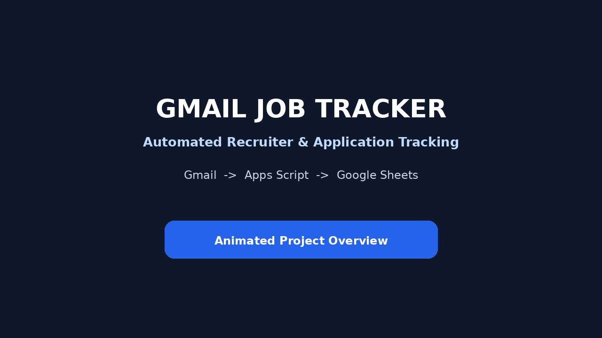
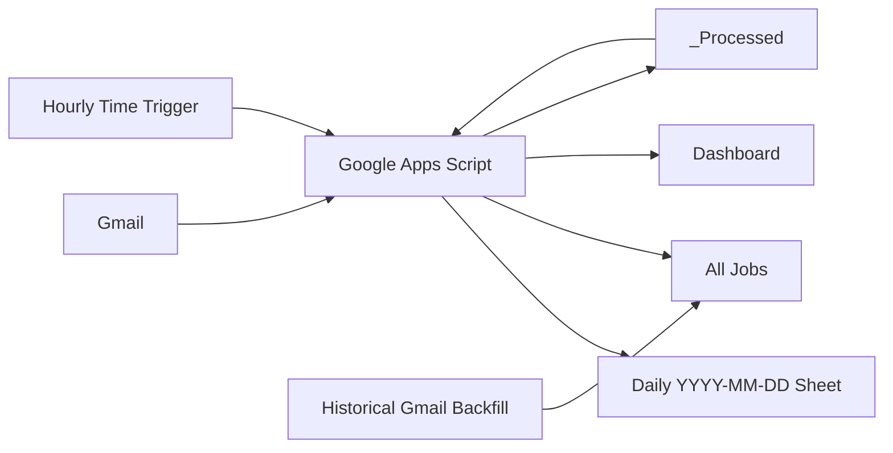

# Gmail Job Tracker — Automated Recruiter & Application Tracking

A Google Apps Script automation that turns Gmail job-search activity into a structured Google Sheets tracking system. It tracks recruiter/vendor outreach, direct job applications, recruiter stages, application statuses, historical activity, daily sheets, a permanent `All Jobs` master view, and a dashboard.

> **The problem:** During an active job search, recruiter conversations, application confirmations, RTR requests, submissions, assessments, interviews, rejections, and offers are spread across Gmail and become difficult to maintain manually in a spreadsheet.
>
> **The fix:** This project scans Gmail on a schedule, classifies job-search messages, writes structured records into Google Sheets, updates existing rows from later status emails, prevents duplicate processing, and can reconstruct historical Gmail activity in batches.

---

## Demo & documentation

[](assets/job-tracker-animated-demo.mp4)

- **Animated project demo (60 seconds):** [`assets/job-tracker-animated-demo.mp4`](assets/job-tracker-animated-demo.mp4)
- **Professional project guide (PDF):** [`docs/Gmail_Job_Tracker_Professional_Guide.pdf`](docs/Gmail_Job_Tracker_Professional_Guide.pdf)
- **Complete A-to-Z setup guide:** [`docs/SETUP_GUIDE.md`](docs/SETUP_GUIDE.md)
- **Architecture:** [`docs/ARCHITECTURE.md`](docs/ARCHITECTURE.md)
- **Status logic:** [`docs/STATUS_LOGIC.md`](docs/STATUS_LOGIC.md)
- **Historical backfill:** [`docs/HISTORICAL_BACKFILL.md`](docs/HISTORICAL_BACKFILL.md)
- **Testing:** [`docs/TESTING.md`](docs/TESTING.md)
- **Troubleshooting:** [`docs/TROUBLESHOOTING.md`](docs/TROUBLESHOOTING.md)
- **Optional live screen-recording script:** [`docs/DEMO_SCRIPT.md`](docs/DEMO_SCRIPT.md)
- **Optional audio presentation script:** [`docs/AUDIO_SCRIPT.md`](docs/AUDIO_SCRIPT.md)

The animated demo and PDF use synthetic examples so the repository can explain the system without exposing a real Gmail inbox, recruiter information, application IDs, or private Google Sheet identifiers.

> The public repository contains no personal Gmail data, recruiter records, OAuth credentials, or private Google Sheet IDs.

---

## Architecture



### Live workflow

```text
Hourly trigger
     ↓
runJobTrackerAutomation()
     ↓
Recruiter sent-email sync
     ↓
Recruiter status sync
     ↓
Portal/direct application sync
     ↓
Application status sync
     ↓
Dashboard refresh
```

### Historical workflow

```text
Historical Gmail
     ↓
Batched processing + saved position
     ↓
Recruiter history
     ↓
Portal application history
     ↓
Portal status history
     ↓
Recruiter status history
     ↓
All Jobs
```

---

## Features

- Automatic daily sheet creation using `YYYY-MM-DD`
- Recruiter/vendor sent-email detection
- Recruiter name, company, email, phone, and job-title extraction
- Sent vs. follow-up detection
- Direct application and ATS confirmation detection
- Portal detection for common job boards and applicant tracking systems
- Company and position extraction from application emails
- Recruiter status tracking
- Portal application status tracking
- Thread-aware row matching
- Status-progression safeguards
- Gmail Message ID duplicate prevention
- Permanent `All Jobs` master sheet
- Batched historical Gmail backfills
- Hidden `_Processed` state sheet
- Google Sheets Dashboard
- Gmail deep links to source threads
- `LockService` protection against overlapping automation runs

---

## Google Sheets design

```text
TEMPLATE
  ├── RECRUITER / VENDOR EMAILS SENT
  ├── exactly 4 blank rows
  └── PORTAL / DIRECT JOB APPLICATIONS

YYYY-MM-DD
YYYY-MM-DD
...

All Jobs
Dashboard
_Processed  (hidden)
```

### Recruiter / Vendor columns

| Date | Company | Recruiter Name | Phone Number | Email | Job Title | Status | Email Link |
|---|---|---|---|---|---|---|---|

### Portal / Direct Application columns

| Date | Portal | Company | Position | Application # | Status | Email Link |
|---|---|---|---|---|---|---|

A sanitized example is available in [`examples/sample-sheet-layout.md`](examples/sample-sheet-layout.md).

---

## Recruiter status engine

Supported statuses:

```text
Sent
Follow-up Sent
Replied
RTR
Submitted
Assessment
Interview
Rejected
Offer
Closed
```

Typical active progression:

```text
Sent → Follow-up Sent → Replied → RTR → Submitted → Assessment → Interview → Offer
```

The tracker prevents lower-stage messages from normally moving an advanced record backward. Terminal outcomes such as `Rejected`, `Closed`, and `Offer` receive special handling.

---

## Portal application status engine

Supported statuses:

```text
Applied
Assessment
Interview
Rejected
Offer
Withdrawn
```

Typical active progression:

```text
Applied → Assessment → Interview → Offer
```

Later status emails update the existing application row instead of creating a new application record when a reliable match is found.

---

## Matching strategy

A status email is not matched only by sender. The automation combines stronger and weaker evidence such as:

- Same Gmail thread
- Exact recruiter email
- Company text
- Job title or position text
- Sender display/domain context

For recruiter records, the same Gmail thread receives very strong preference. Fallback recruiter matching requires the recruiter email together with job/company evidence. Ambiguous ties can be rejected instead of guessed.

See [`docs/STATUS_LOGIC.md`](docs/STATUS_LOGIC.md).

---

## Duplicate prevention

A hidden `_Processed` sheet records a workflow type together with the Gmail Message ID. This makes scheduled runs idempotent for the same workflow.

Example processing keys:

```text
RECRUITER
PORTAL
STATUS
RECRUITER_STATUS
ALL_RECRUITER
ALL_PORTAL
ALL_RECRUITER_STATUS
ALL_PORTAL_STATUS
```

---

## Historical backfill

Large Gmail accounts cannot safely be reconstructed in one Apps Script execution. Historical workflows therefore use:

- Batch sizes
- Script Properties for saved Gmail positions
- Temporary time-driven triggers
- Message-ID duplicate tracking
- `LockService`

The current implementation uses Gmail search offsets. This works for staged imports but mailbox ordering can change during a long-running import; a date/cursor strategy plus a final verification pass is a planned improvement.

See [`docs/HISTORICAL_BACKFILL.md`](docs/HISTORICAL_BACKFILL.md).

---

## Dashboard

The Dashboard summarizes:

**Today**
- Recruiter/vendor emails
- Applications

**Recruiter / Vendor summary**
- Total recruiter emails
- Sent
- Follow-up Sent
- Replied
- RTR
- Submitted
- Assessment
- Interview
- Rejected
- Offer
- Closed

**Portal / Direct Application summary**
- Total applications
- Applied
- Assessment
- Interview
- Rejected
- Offer
- Withdrawn

---

## Tech stack

| Layer | Technology |
|---|---|
| Language | JavaScript / Google Apps Script V8 |
| Automation | Google Apps Script |
| Email | Gmail / `GmailApp` |
| Storage | Google Sheets |
| Scheduling | Apps Script time-driven triggers |
| State | Script Properties + `_Processed` sheet |
| Concurrency | `LockService` |
| Dashboard | Google Sheets |
| Source control | GitHub |

---

## Security & privacy

The public source is sanitized. The first source module contains:

```javascript
const SPREADSHEET_ID = 'YOUR_GOOGLE_SHEET_ID_HERE';
```

Replace that placeholder only in your private Apps Script deployment.

Never commit:

- Real Google Sheet IDs
- Gmail exports or copied private email content
- Recruiter email addresses or phone numbers from real activity
- OAuth tokens or client secrets
- `.clasp.json` from a private Apps Script project
- Screenshots exposing real application or account data

See [`SECURITY.md`](SECURITY.md).

---

## Quick start

1. Read the professional PDF overview: [`docs/Gmail_Job_Tracker_Professional_Guide.pdf`](docs/Gmail_Job_Tracker_Professional_Guide.pdf).
2. Create the Google Sheet template described in [`docs/SETUP_GUIDE.md`](docs/SETUP_GUIDE.md).
3. Create a standalone Google Apps Script project.
4. Add every `.gs` file from [`src/`](src/) to that same Apps Script project.
5. Replace `YOUR_GOOGLE_SHEET_ID_HERE` in your **private** copy with the tracker spreadsheet ID.
6. Authorize Gmail and Google Sheets access.
7. Run `testSpreadsheetConnection()`.
8. Run the live sync tests described in [`docs/TESTING.md`](docs/TESTING.md).
9. Create the `All Jobs` sheet and Dashboard.
10. Add a time-driven trigger for `runJobTrackerAutomation()`.
11. Run historical backfills only when intentionally reconstructing older Gmail activity.

Apps Script loads all `.gs` files in one project into a shared global namespace. The numbered files in `src/` preserve the original source order for readability.

---

## Important functions

| Function | Purpose |
|---|---|
| `createTodaySheet()` | Creates today's sheet from `TEMPLATE` |
| `syncRecruiterSentEmailsToSheet()` | Tracks outgoing recruiter/vendor activity |
| `syncPortalApplicationsToSheet()` | Tracks direct/portal applications |
| `syncRecruiterStatuses()` | Updates recruiter/vendor stages |
| `syncApplicationStatuses()` | Updates portal application stages |
| `runJobTrackerAutomation()` | Runs the normal live workflow |
| `createAllJobsSheet()` | Creates the permanent master sheet |
| `refreshJobDashboard()` | Rebuilds Dashboard counts |
| `checkAllJobsBackfillProgress()` | Logs historical-import progress |

---

## Repository structure

```text
Job-Tracker-Automation/
├── README.md
├── appsscript.json
├── .gitignore
├── LICENSE
├── CHANGELOG.md
├── SECURITY.md
├── CONTRIBUTING.md
├── src/
│   ├── README.md
│   ├── 01-test-spreadsheet-connection.gs
│   ├── ...
│   └── 25-refresh-job-dashboard.gs
├── docs/
│   ├── README.md
│   ├── Gmail_Job_Tracker_Professional_Guide.pdf
│   ├── SETUP_GUIDE.md
│   ├── ARCHITECTURE.md
│   ├── STATUS_LOGIC.md
│   ├── HISTORICAL_BACKFILL.md
│   ├── TESTING.md
│   ├── TROUBLESHOOTING.md
│   ├── DEMO_SCRIPT.md
│   └── AUDIO_SCRIPT.md
├── examples/
│   └── sample-sheet-layout.md
└── assets/
    ├── demo-poster.png
    ├── job-tracker-animated-demo.mp4
    └── README.md
```

---

## Testing

The project includes test helpers for spreadsheet connectivity, daily sheet creation, sent-email scanning, recruiter detection, application detection, duplicate handling, status progression, and the master automation.

Use synthetic messages before testing against a production mailbox. See [`docs/TESTING.md`](docs/TESTING.md).

---

## What I'd build next

- Replace offset-based historical pagination with date/cursor-based scanning
- Use one incremental Gmail cursor for faster live runs
- Add automated unit tests for pure classification/extraction functions
- Add configurable keyword and ATS rules
- Normalize company and job-title variants
- Add weekly funnel and conversion analytics
- Add interview-to-offer metrics
- Add a setup wizard for properties and triggers
- Add a multi-user deployment model

---

## Suggested GitHub topics

`google-apps-script` · `gmail` · `google-sheets` · `javascript` · `automation` · `job-search` · `job-tracker` · `email-automation` · `workflow-automation` · `productivity`

---

## License

MIT License. See [`LICENSE`](LICENSE).

## Author

Siva Sankeerth Damineni
