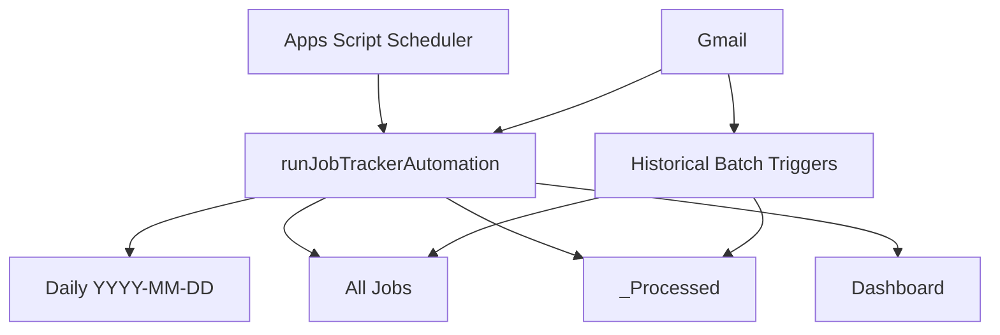

# Architecture

## Overview

The project has two independent workloads: live tracking and historical reconstruction.

## Live automation

`runJobTrackerAutomation()` is the main orchestrator. It acquires a script lock, runs the live sync functions, refreshes the Dashboard, logs completion, and releases the lock.

The daily tracker is generated from `TEMPLATE` on demand. This keeps the layout consistent while allowing a new dated sheet to be created automatically.

## Detection layer

The project uses transparent rule-based classification rather than an opaque model. It evaluates subjects, senders, message text, thread context, known ATS domains, and job-search phrases.

## Extraction layer

Recruiter records can include:

- Company inferred from recruiter email domain
- Recruiter display name and email address
- Recruiter phone found in earlier incoming thread messages
- Job title extracted from the email subject
- Sent vs. follow-up state
- Gmail deep link

Application records can include:

- Portal/ATS
- Company
- Position
- Sequential application number
- Application status
- Gmail deep link

## Matching layer

Later status messages must be associated with an existing row. Thread matches receive strong preference. Additional evidence includes recruiter email, company, and job/position text. Ambiguous ties can be rejected instead of guessed.

## State and idempotency

The hidden `_Processed` sheet stores workflow type + Gmail Message ID. This prevents the same message from repeatedly creating the same record when scheduled jobs overlap or rerun.

Script Properties store historical backfill positions and active flags so multi-run imports can continue where a previous batch stopped.

## Historical backfill

Large Gmail histories are processed with small scheduled batches. Each historical workflow creates a temporary trigger, advances a saved search position, and deletes the temporary trigger when finished.

## Concurrency

`LockService` is used in the master automation and historical batch functions to reduce concurrent writes to the same workbook.

## Known architectural limitation

The current historical implementation uses Gmail search offsets. When mailbox ordering changes during a long multi-day import, offsets can theoretically revisit or skip threads. Message-ID duplicate tracking protects against revisits, but not every possible skip. A date/cursor-based backfill is recommended for a future version.
